# Getting the data
I started the project by exploring the dataset. Below, there are examples of the two classes in the dataset.

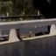

This [PyImageSearch blog post](http://www.pyimagesearch.com/2014/11/10/histogram-oriented-gradients-object-detection/) suggested that the number P of object images in the dataset should be much smaller than the number of non-object images. This class imbalance was something I experimented with. I tried 25%, 50%, ~66% car samples compared with the non-car samples. In the end, I used all the data since I observed that the number of false positives was higher otherwise.

I did not make any special dataset preparation, such as removing very similar car frames.

# Feature extraction

There were 3 types of features I tried:
 - spatial: pixels of a sized down version of the input image;
 - color histogram: color histogram of the channels of the image;
 - Histogram of Oriented Gradients (HOG): a kind of signature based on the local  directions of the gradient of a channel of an image.

The code for these is in the `lessons.py` file and is mostly the code presented during the classes. More specifically, in the functions `bin_spatial`, `color_hist` and `get_hog_features`.

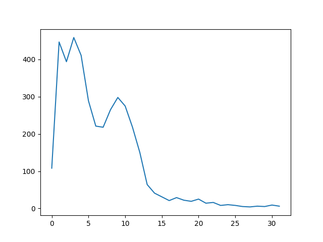

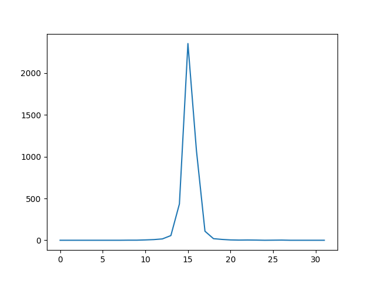

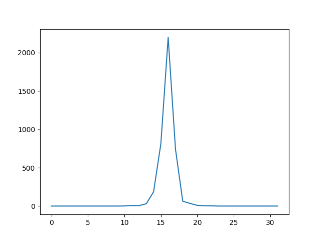

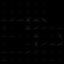

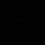

Each of these features has parameters to tune. Besides those parameters, an appropriate color representation must be chosen. I experimented with RGB, HLS, HSV, LUV and YCrCb.

I went through several iterations of the parameters. The HOG takes the longer to compute and usually made up for over 90% of the computation time of the pipeline.

I started with the RGB color representation, but felt that color and other properties such as brightness should separated as much as possible. I soon moved on to the other representations, eventually landing on YCbCr, which gave the highest accuracy score.

For the most part, I used a `32x32` version of the image as spatial features, but also experimented with `16x16`; `32` bins for the color histogram - changing this in the interval [`16`, `48`] did not have a significant effect on accuracy. The HOG parameters affected the accuracy the most. Using a HOG of all channels of the image was one of the most worthwhile choices. Increasing the pixels per cell from `8x8` to `16x16` improved the speed but the accuracy suffered, so I left it at `8x8`. I experimented little on cells per block, but the little I experimented (small changes) did not produce significant changes in accuracy or observed detections, false positives, etc. I used `9` orientations and, for the same reason as before, that was also the final value.

In the end, I used only the HOG features. With these alone, the accuracy was over 98% and I did not see an adverse effect on the performance of the pipeline in the test images or the test video.

I did not use the single HOG extraction (for the whole image and then subsample) because it gave different results - it had less detections. Howerver, this is a much faster process. To mitigate the that issue, I used the multiprocessing module to speed up the processing of the video frames - the windows to be analyzed are divided between N processes, passed as a CLI argument.

# Classifier training
eatures should be
Before training, I scaled the features to zero mean and unit variance with a `StandardScaler` from scikit-learn. I used a linear Support Vector Machine as a classifier with the default parameters and did not change them since the accuracy was already high. Furthermore, changes in the feature parameters proved to be much more significant in classifier accuracy. The code for the training is in `train_mp.py`.

# Sliding window
I started with the implementation of the sliding window provided in the lessons. However, I noticed that it had the problem, particularly with large window sizes, to miss pixels on the right and on the bottom (when window sizes were not multiples of the valid image area to search). To address this, I added code to add windows touching the right and bottom edges if the space left out is above a certain threshold. This is performed by the `slide_window` function in  `lessons.py`.

Cars appear with different sizes in an image. Because of that, using windows  of multiple sizes is important for a robust search. I experimented with several window sizes and overlap values. I left the base window size at `64x64` and changed the scale value. My setup was such that I specified a scale interval and the number of scales I wanted to use, e.g. `4` equally spaced scales in the interval `[1,4]`, and my pipeline would produce the desired windows in the scales {1,2,3,4}. The final parameters were a base window size of `64x64`, an interval of `[1,4]`, an overlap of `0.5` (50%), `8` scales over a search area on the interval `[400, 656]` on the y axis.

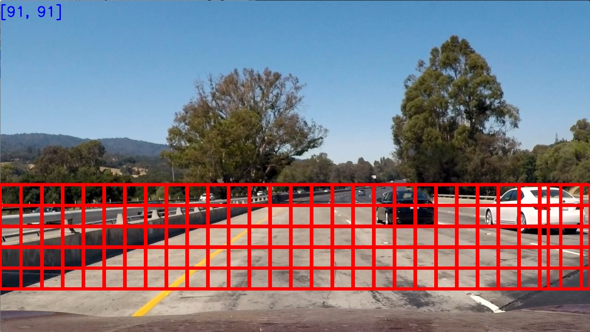

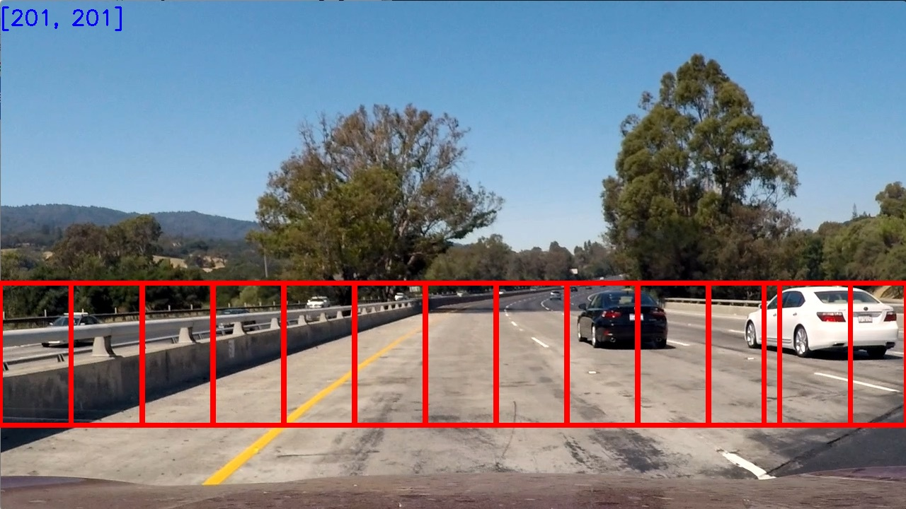

# False positives

To address the false positives issue, a heatmap kind of strategy was used. The areas occupied by detections windows are incremented by 1 in a zeroed matrix of the same size as the image. Then a threshold is applied such that all positions where the value is below the threshold are zeroed.

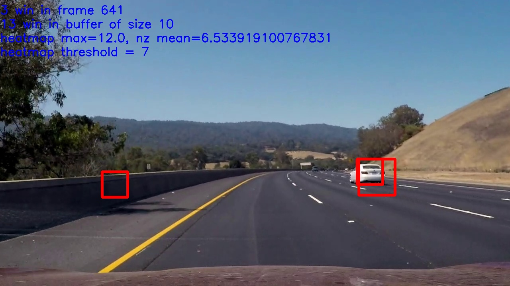

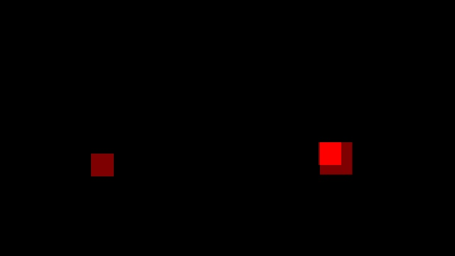

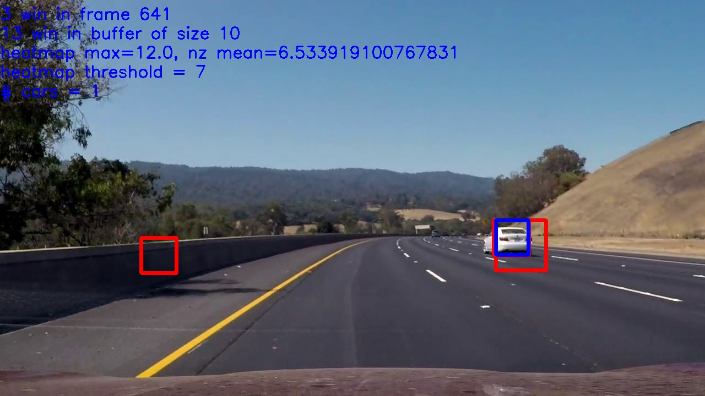

# Strategy for video

The use of a thresholded heatmap is a good strategy to start with, but when applied to video it does not work well if used with a single frame. In that case we want to look for both temporal and spatial consistency, meaning we many detections on the same place over several frames.

This strategy has both the effect of mitigating the appearance of false positives as well as guaranteeing that on frames where there are not enough detection windows to trigger a true detection, it still happens because of the temporal consistency (as long as the previous frames had enough detection windows on the correct area.).

In the end, a buffer of `10` frames was used with a threshold of `7`. I came to this values by adjusting the values interactively (running `tweak.py` on extracted video frames).

Before settling on this final result, I experimented with a second strategy using a two layer threshold (once on single frames and then on the buffer of the heatmaps). That strategy did not work since it made the final detections less stable, even though it was more effective with false positives.

To get the final detection, the thresholded heatmap is fed into `scipy.ndimage.measurements.label` to identify individual blobs. The blobs that had a minimum width of `20` and height of `20` were kept as the final detections.

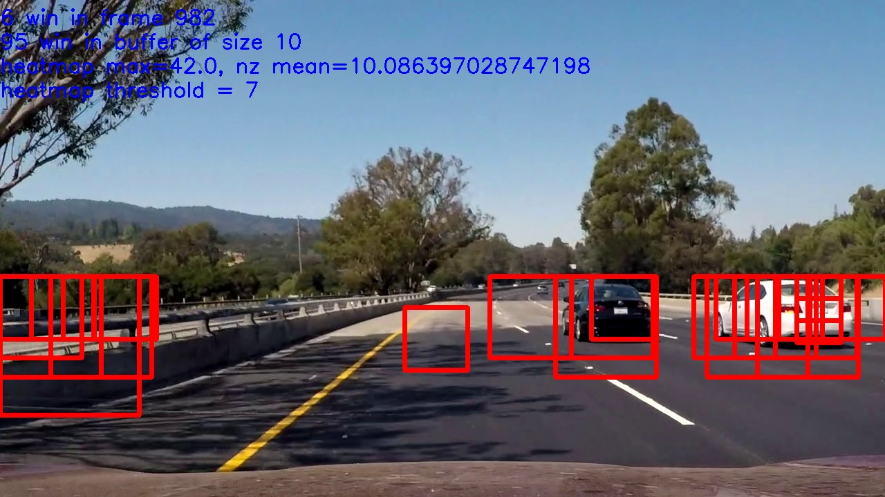

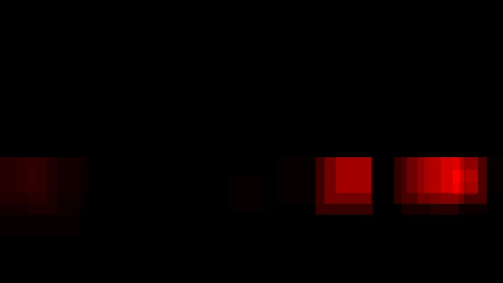

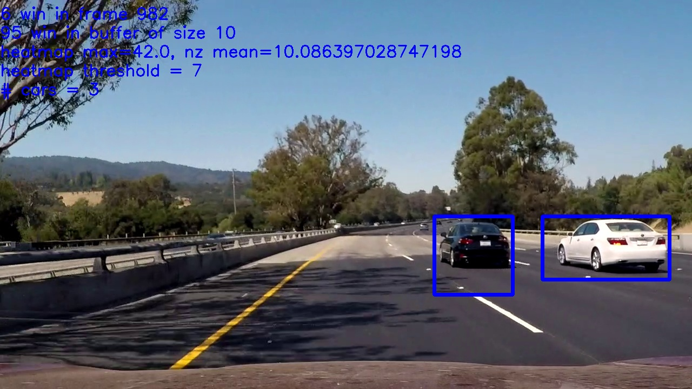

# Final video

The final video `output_video.mp4` ([Youtube link](https://youtu.be/Ud_cShMtWxs), [GIthub link](https://github.com/diogo-aos/CarND-Vehicle-Detection/blob/master/output_video.mp4?raw=true)) was generated using `imgs2video.py` which takes in the video frames, the run configuration (window detections, sliding window parameters, feature extraction parameters), the buffer size and the threshold value. The window detections are created with `video_frames.py` which takes in the run configuration, extracts features for each frames and saves a list of all detection windows for each frame. This last script uses the `pipeline_mp.py` module, which is what contains the actual pipeline that processes the frames and processes the search windows in a parallel manner.

# Discussion

Even with multiprocessing this implementation is not real time ready. The best I could get was just under 1 second for the processing of 1 frame. Using a single HOG per scale would definitely help making it more real-time friendly.

My implementation seems to fail when car is at the very right edge of the image and on places with shadows, for brief moments. I tried to mitigate the former by creating extra search windows on the right and bottom edges of the search area, which helped, but still does not perform well enough. One reason might also be that the dataset is mostly of images of entire cars, not of parts of cars.

My implementation does not use the fact that the blobs in the heatmap are persistent objects in the real world. Using this information to somehow model where the objects would appear in the next frames based on previous frames might make the implementation more robust. In a real life implementation, we would probably want to track both the speed of our car and that of the cars surrounding us to make good predictions, perhaps using the same technique as the one used before to detect the distance from the car to the lane markings in the previous project (i.e. detecting the distance from our car to others and use our speed and their change in image position to detect their speed).
